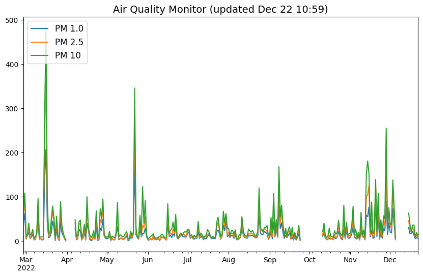
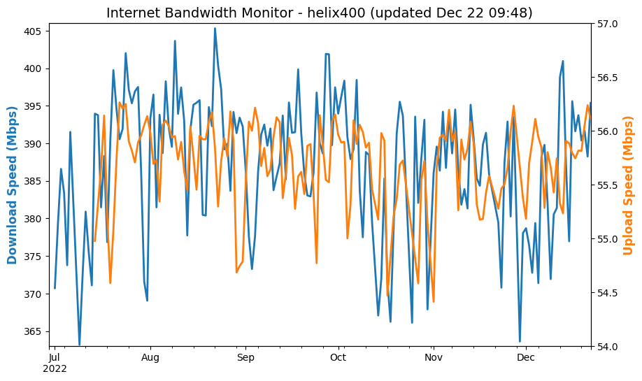
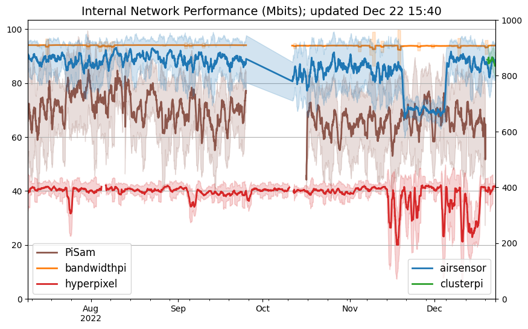
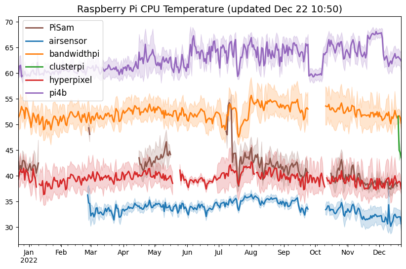
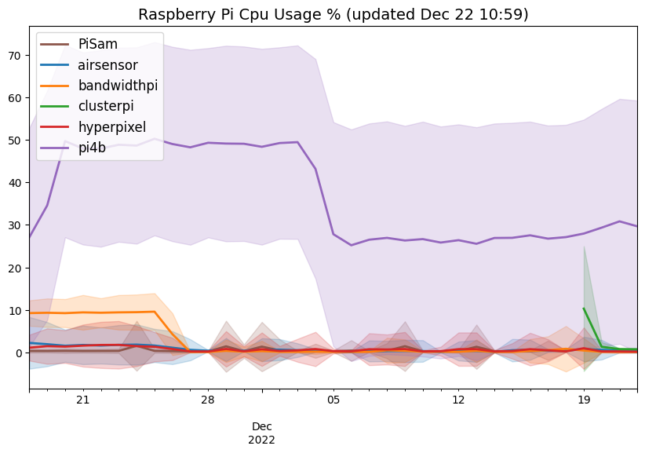
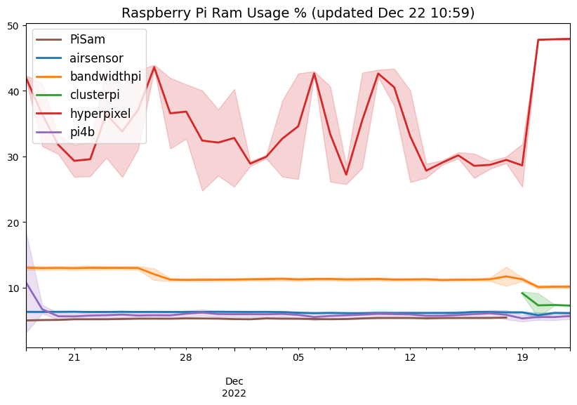
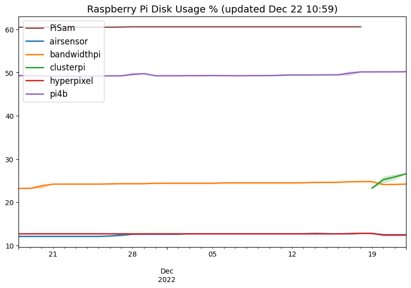
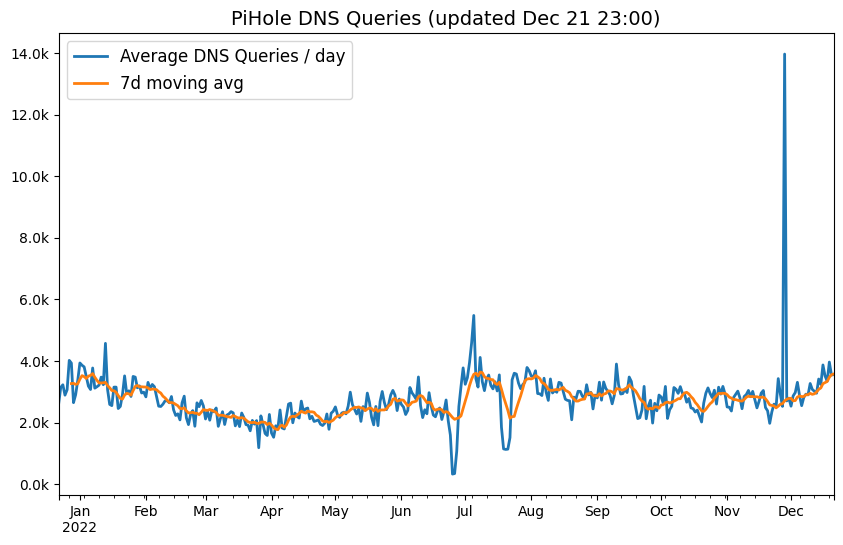

# HyperPixelCharts

RaspberryPi project using a [HyperPixel 4.0 display](https://shop.pimoroni.com/products/hyperpixel-4?variant=12569539706963) to render pre-generated image files / charts

This project includes the TCP socket-based server process which accepts the following network commands:
- `on` : turn LCD on
- `off` : turn LCD off
- `previous` : show the previous image from the configured directory
- `next` : show the next image from the configured directory

The server will display the image in full screen on the HyperPixel display, and will monitor the image file for changes (via polling) and automatically refresh the image shown if the file changes.

This uses a low-level X11 utility called `feh` to display the image full-screen (install with `sudo apt-get install feh`)

The `generate_charts.py` script is used to generate a bunch of charts using Pandas / MatPlotLib and save them as `.png` files which can then be rendered on the HyperPixel display

The following are supported:
- Query [OpenCovid.ca](http://opencovid.ca) to get some stats on COVID-19 in Canada
- Measure CPU temperature (using `measure_temp.sh`) of Raspberry Pi computers and render as a line chart
- Query [Pi-Hole DNS Ad-Blocker](https://pi-hole.net/) for usage statistics and render as a chart
- Display Internet Bandwidth upload/download speed (from the [bandwidthpi](https://github.com/brunon/bandwidthpi) project)
- Display internal network bandwidth measuring using iperf3 on Raspberry Pi
- Display CPU/RAM/DISK statistics from Raspberry Pi computers
- Display particulate matter environment statistics (from the [AirQualityMonitor](https://github.com/brunon/AirQualityMonitor) project)

Here are some examples monitoring my personal home network:

### Air Quality

### Internet Bandwidth

### Internal Network Bandwidth

### Raspberry Pi CPU Temperature

### Raspberry Pi Statistics

### PiHole DNS Query Stats

